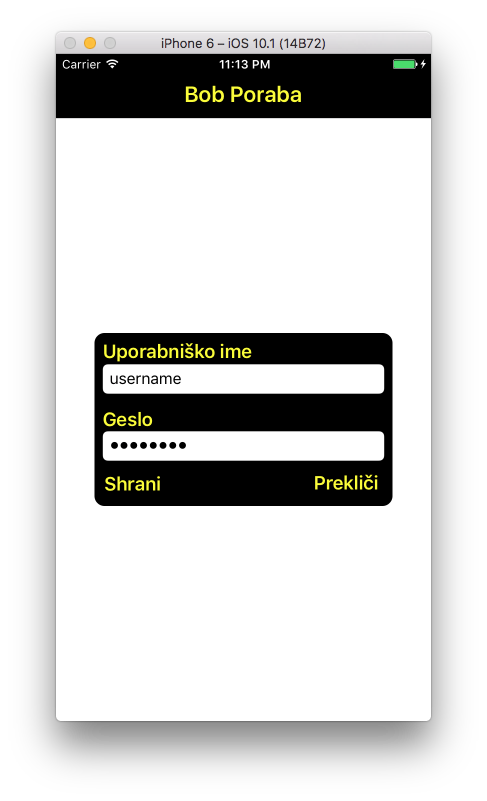
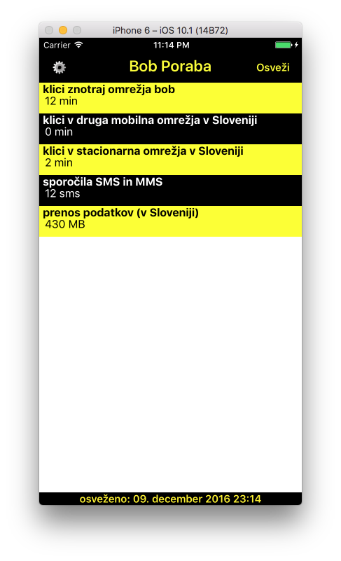
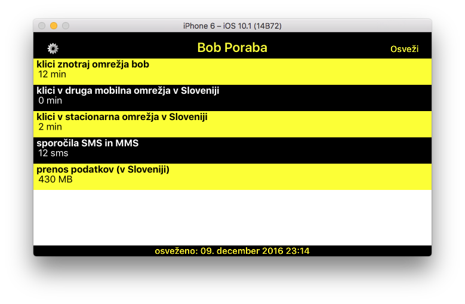

# BobPoraba
App for checking calls/sms/data usage for Slovenian carrier Bob. I have added login example for three common programming languages: swift, C# and php. You can download it here: https://itunes.apple.com/si/app/bobmonitor/id577047787?mt=8

# version for iOS (Swift)
Swift version of BobPoraba app that runs on iOS devices. It has simple UI associated with carrier Bob colours. Download link: https://itunes.apple.com/si/app/bobmonitor/id577047787?mt=8
 
Screenshots: 

# C# console application
This is just an example how to login into moj.bob.si page using C#. You could do some additional parsing to get more information about your account.

How to run: 
-set username and password in Program.cs

# PHP version
Simple example of logging into moj.bob.si using curl - php. This version could be run on php hosting without modification.

How to run: 
-set username and password in script
